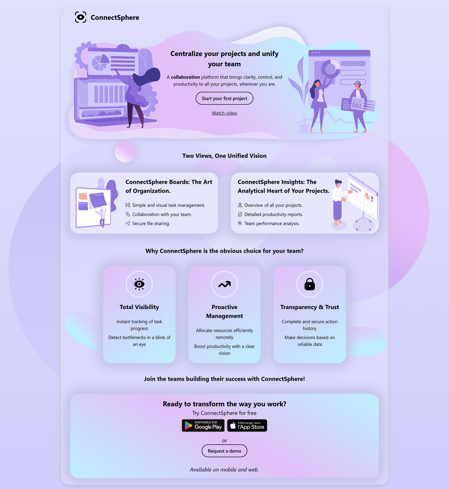

# Landing Page Template - ConnectSphere

This project is a modern and responsive landing page template, designed to showcase SaaS applications, software, or digital products. It is based on the "ConnectSphere" design (a fictional product used for demonstration).

## Features

- **Clean Design**: A clear user interface focused on conversion.
- **Responsive**: Adapts perfectly to mobiles, tablets, and desktops.
- **HTML5 & CSS3**: Semantic, lightweight, and easy-to-customize code.
- **Key Sections**: Header (Hero), features presentation, benefits, and call to action (CTA).

## How to use

1. Download the project files.
2. Open the `index.html` file in your browser to see the result.
3. To customize the content, edit the HTML file.
4. To modify the style, edit the `css/style.css` file.

## Project Structure

- Contains the source code of the site (HTML, CSS, JS, Images).

## Contributing

Contributions are welcome! If you have suggestions for improvements or bug fixes, please follow these steps:

1. Fork the repository.
2. Create a new branch (`git checkout -b feature/YourFeature`).
3. Commit your changes (`git commit -m 'Add some feature'`).
4. Push to the branch (`git push origin feature/YourFeature`).
5. Open a Pull Request.

## License

This project is distributed under the MIT license. You are free to use, modify, and distribute it for personal or commercial projects. See the `LICENSE` file for more details.
